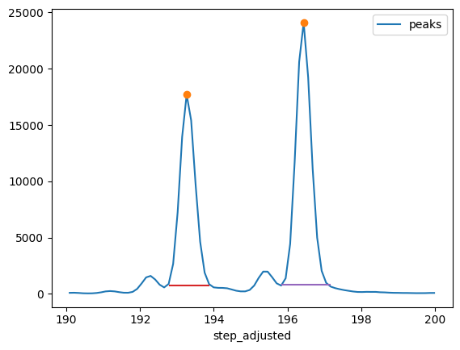

## ladder map

Matches ladders to peaks by correlation for fragment analysis. The strategy resembles the one used by [Fragman](https://cran.r-project.org/web/packages/Fragman/index.html) for R.

One difference is that combinations of peaks are generated using [NetworkX](https://networkx.org/) to eliminate impossible combinations. This reduces complexity substantially and allows for an exhaustive search to identify the best match.


## Usage

The library exists of two main classes, namely `LadderMap` and `PeakArea`. 
`LadderMap` matches ladders to peaks by correlation and stores peak and ladder information. The have methods to reassign timeseries data to basepair steps using linear regression. 

`PeakArea` calculates peak area.

### Example Usage
```python
from fragment_analyzer.ladder_map import LadderMap, PeakArea

data = "demo/4071_Dx 230113_PRT1_PRT3_rn/PRT3_NA18507_4071_D11_Dx.fsa"

laddermap = LadderMap(data)

peak_area = PeakArea(
    laddermap.adjusted_step_dataframe(),
    start=190, 
    end=200,
    rel_height=.97
)

peak_area.plot_peak_widths()
peak_area.calculate_peak_area(function="trapz")
```
### Output
`Area(left_area=72643.5, right_area=100500.0, area_quotient=1.383468582873898)`



