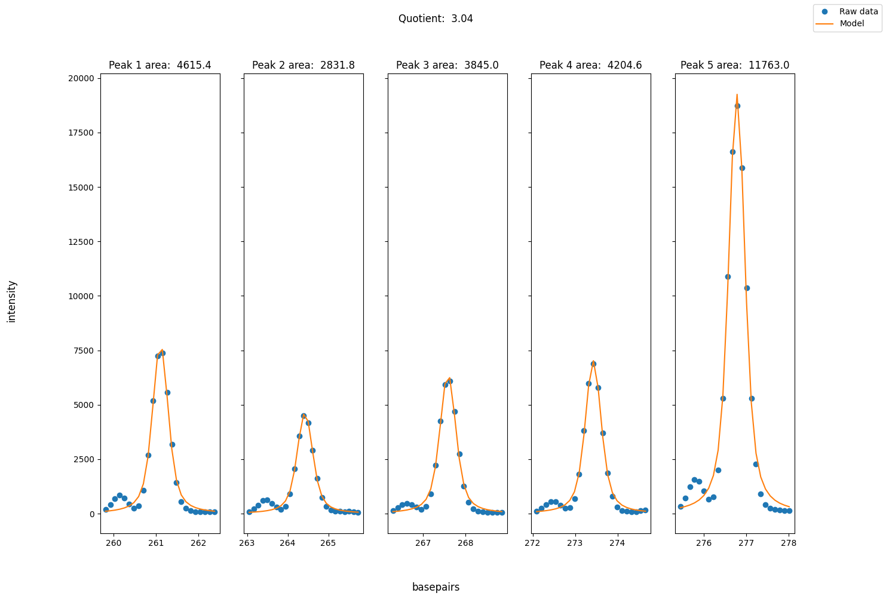

## ladder map

Matches ladders to peaks by correlation for fragment analysis. The strategy resembles the one used by [Fragman](https://cran.r-project.org/web/packages/Fragman/index.html) for R.

One difference is that combinations of peaks are generated using [NetworkX](https://networkx.org/) to eliminate impossible combinations. This reduces complexity substantially and allows for an exhaustive search to identify the best match.

## Install

```bash
git clone https://github.com/Clinical-Genomics-Umea/ladder_map.git
cd fragment_analyzer
pip install . 
```

## Usage

The library exists of two main classes, namely `LadderMap` and `PeakArea`. 
`LadderMap` matches ladders to peaks by correlation and stores peak and ladder information. The have methods to reassign timeseries data to basepair steps using linear regression. 

`PeakArea` calculates peak area.

### Example Usage

#### Area under curve using naive integrals
```python
from fragment_analyzer.ladder_map import LadderMap, PeakArea

data = "demo/4071_Dx 230113_PRT1_PRT3_rn/PRT3_NA18507_4071_D11_Dx.fsa"

laddermap = LadderMap(data)

peak_area = PeakArea(
    laddermap.adjusted_step_dataframe(),
    start=190, 
    end=200,
    rel_height=.97
)

peak_area.plot_peak_widths()
peak_area.calculate_peak_area(function="trapz")
```
#### Output
`Area(left_area=72643.5, right_area=100500.0, area_quotient=1.383468582873898)`


#### Visualization of best sample ladder peaks
```python
fig = laddermap.plot_best_sample_ladder()
```
#### Output


#### Fitting model to the data
##### Voigt Distribution
```python
peak_area.plot_lmfit_model("voigt")
```
#### Output


##### Gauss Distribution
```python
peak_area.plot_lmfit_model("gauss")
```
#### Output


#### Looking at more than two peaks
```python
peak_area = PeakArea(
    laddermap.adjusted_step_dataframe(channel="DATA1"),
    start=250, 
    end=300,
    num_peaks=4,
    padding=2,
    model="voigt"
)


peak_area.plot_lmfit_model()
```
The last peak is divided by the mean of the peaks to the left of it:
#### Output


#### If data needs baseline correction and normalization:
```python
laddermap = LadderMap(data, normalize_peaks=False)
```
Messy output
#### Output


#### Normalized data:
```python
laddermap = LadderMap(data, normalize_peaks=True)
```
Normalized peaks:
#### Output


#### Generate report:
```python
from fragment_analyzer import LadderMap, PeakArea, generate_report

data = "demo/4062_Dx/3_PRT_2_4062_C02_Dx.fsa"
laddermap = LadderMap(data, normalize_peaks=False)
peak_area = PeakArea(
    laddermap.adjusted_step_dataframe(channel="DATA1"),
    start=200, 
    end=250,
    num_peaks=2,
    padding=2,
    model="gauss"
)

generate_report(laddermap, peak_area, name="my_folder/my-report")
```
The report is saves in `my_folder` as `my-report.html`.
An example report can be found in `examples`


